# How to setup MySQL?

1. Go to [MySql downloader](https://dev.mysql.com/downloads/installer/) and choose your operating system and proceed to download.

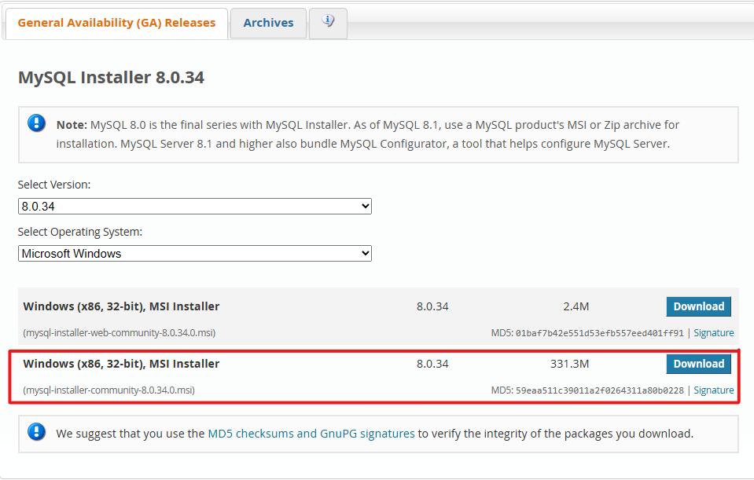

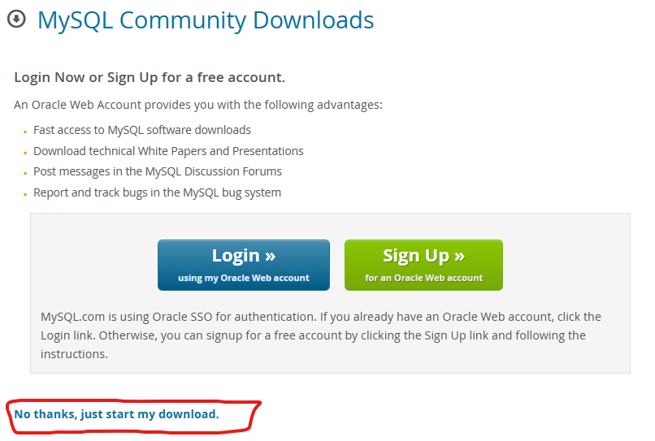

2. Open the installer and proceed with installation.
3. For a localhost choose do a full installation and click next.

   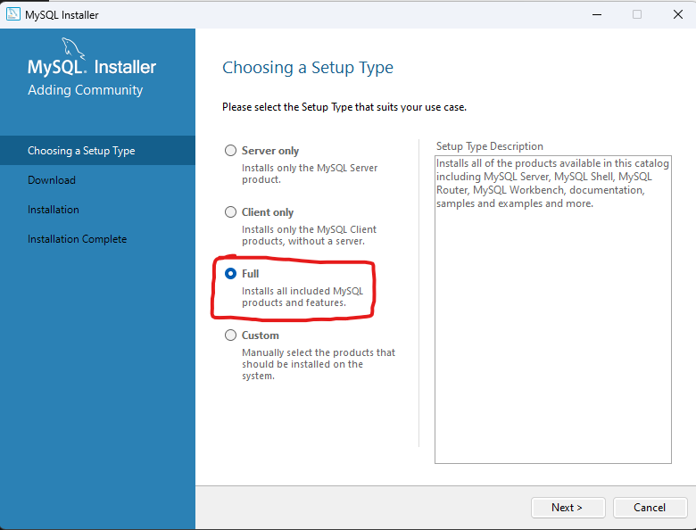
4. Click execute. After installation click next.

   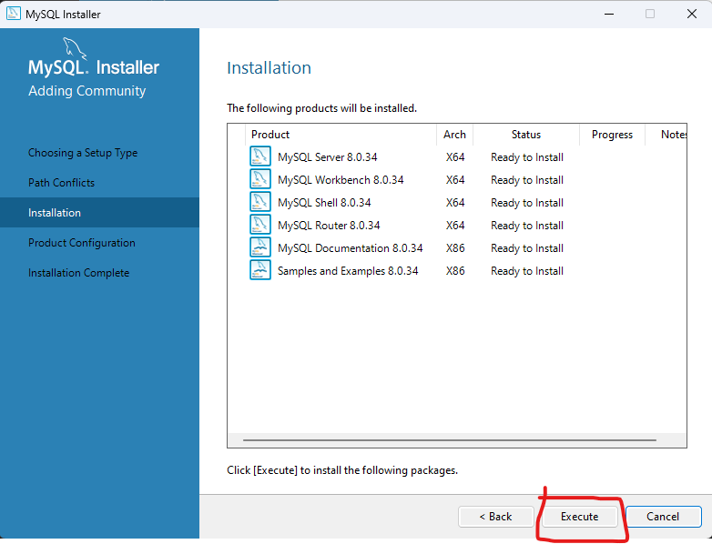
5. Click next.

   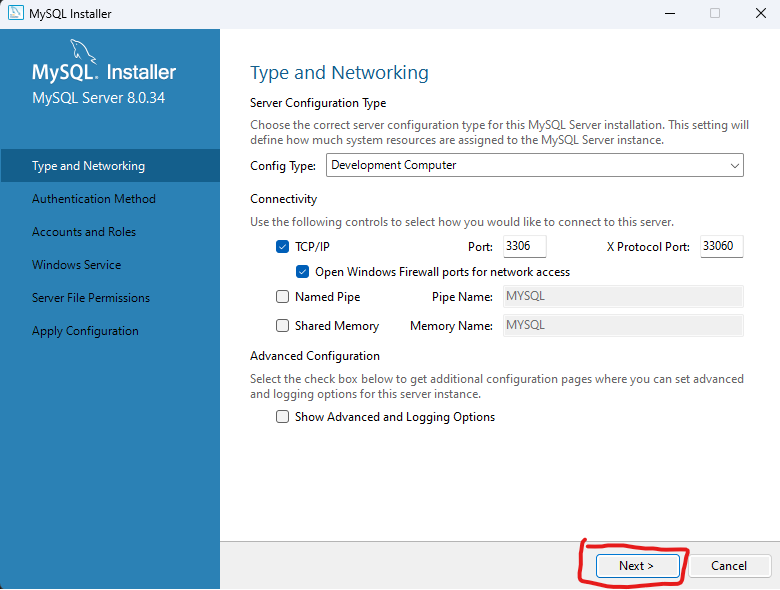

   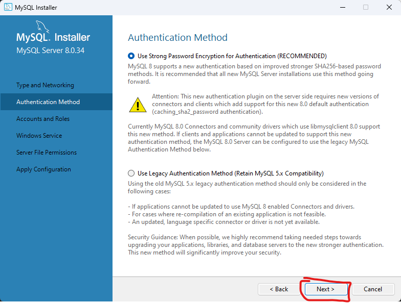
6. Setup root user password. Click next

   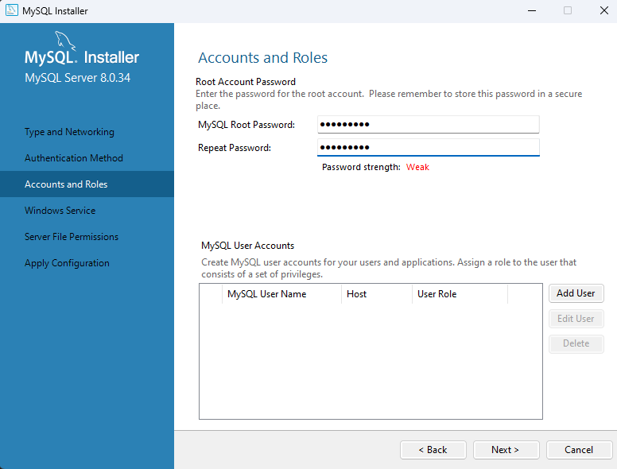
7. Click next. (OPTIONAL: Uncheck : Start the MySQL Server at System Startup)

   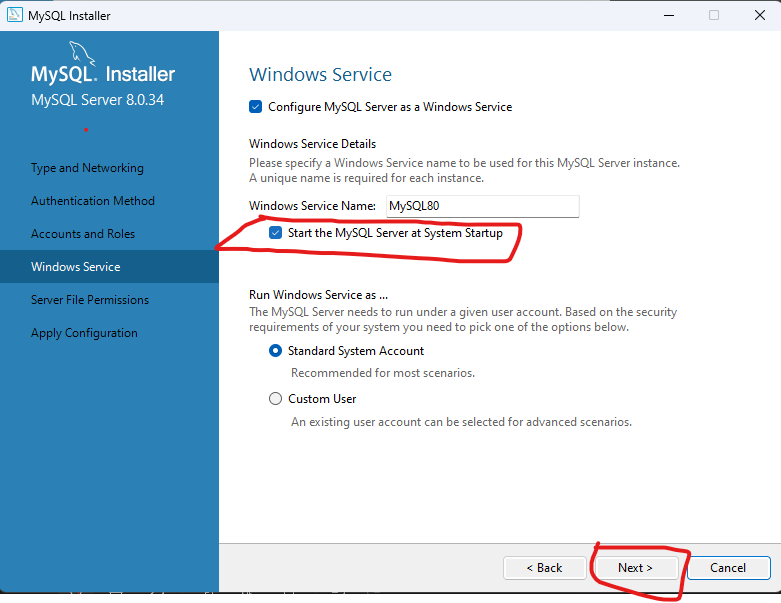
8. Click execute.

   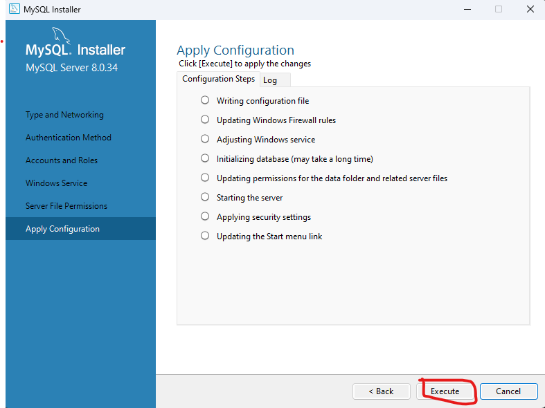
9. Click finish

   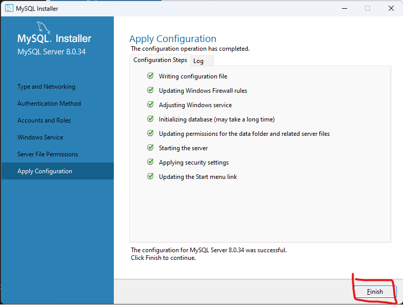
10. Click next.

    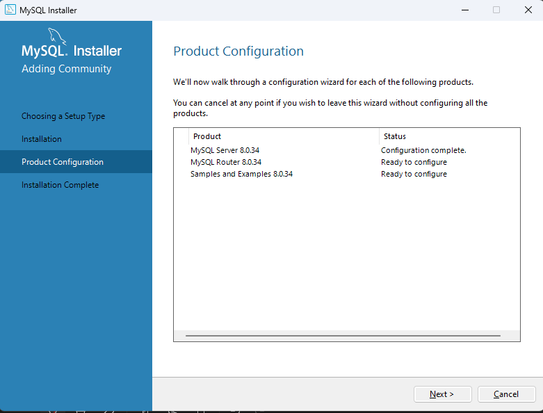
11. Click finish.

    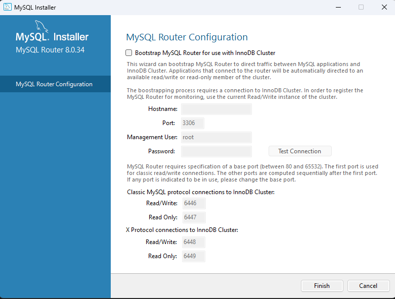
12. Enter the root user password (Which we setup early) and click check.

    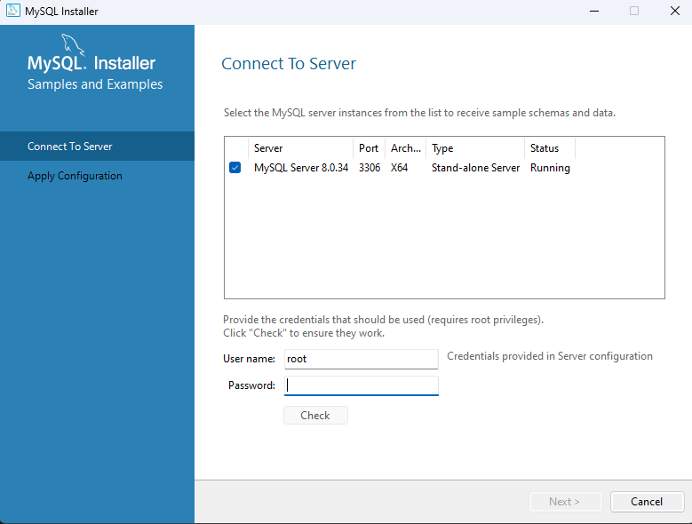
13. Click next and then execute.

    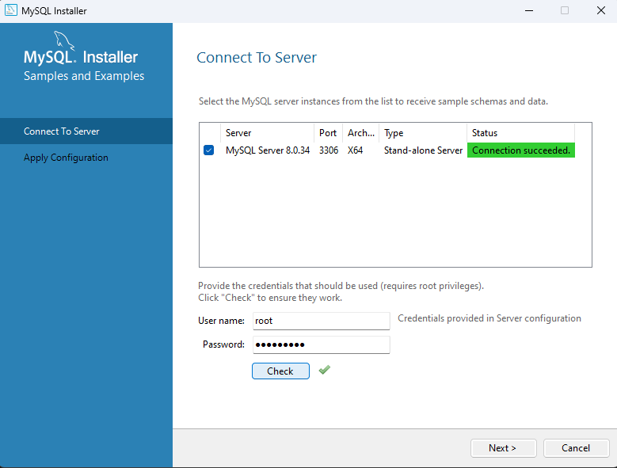
14. Click finish

    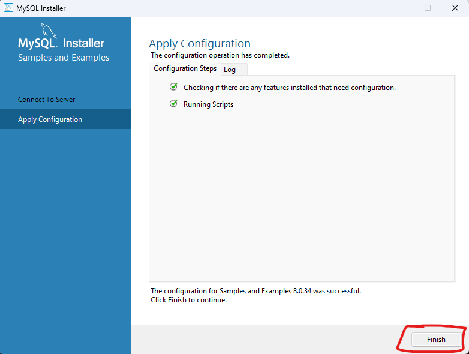
15. Click finish.

    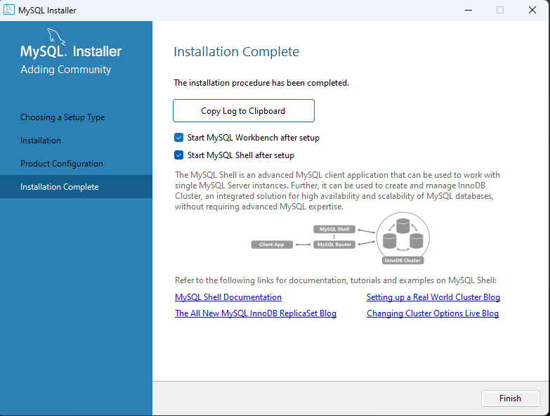
16. Congratulations! MySQL for localhost is setup.

# Using MySQL to run .sql file

1. Open MySQL Workbench

   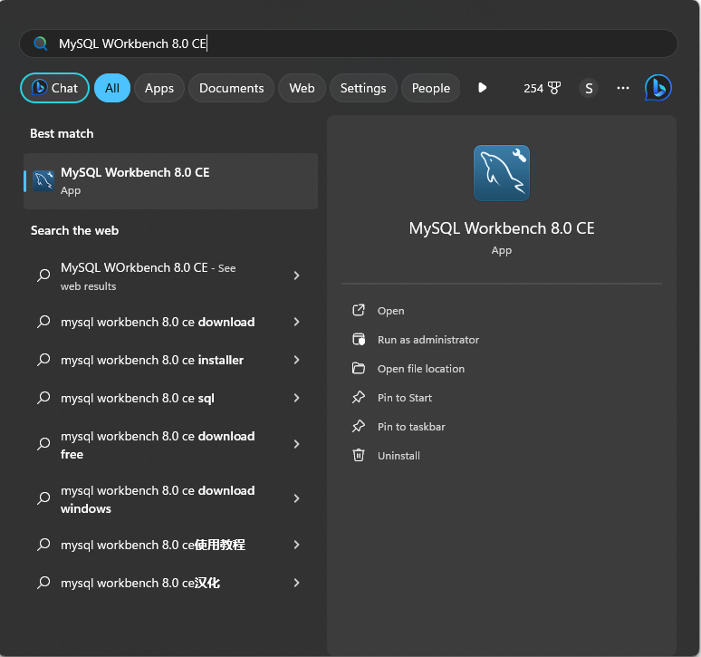
2. Open local instance server.

   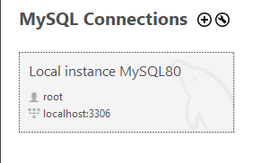
3. Enter root password to gain access.

   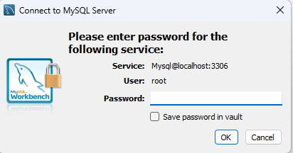
4. SQL queries can be run here.

   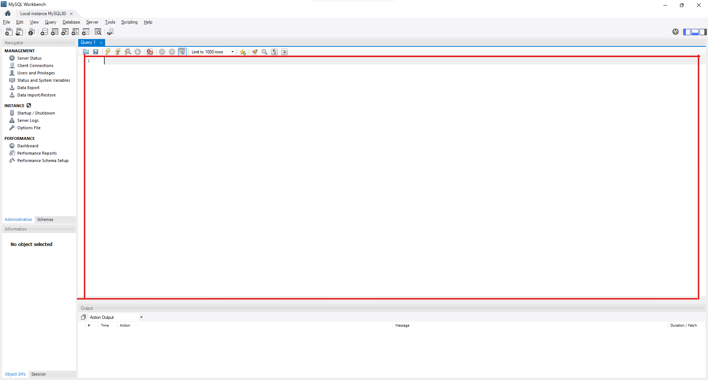
5. Select the script snippet which has to be run and click on run selected script.

   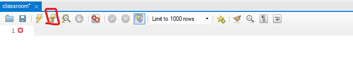

# Using Eclipse to add required files

1. Open eclipse workspace
2. Open this folder (Spring Dale College)
3. Right click on the folder name in eclipse
4. Click on build path > Configure build path > libraries
5. Click on ModulePath
6. Click on Add External JARs

   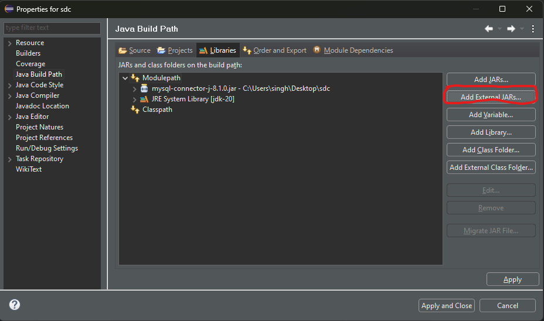
7. Browse for Spring Dale College > mysql-connector-j-8.1.0.jar
8. Click open and then apply and close.
9. We are ready to go.

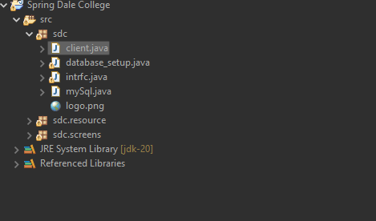

10. Run the client.java file
11. For the first time login with the database admin credentials (i.e with the root user which we created earlier in MySQL Workbench.
